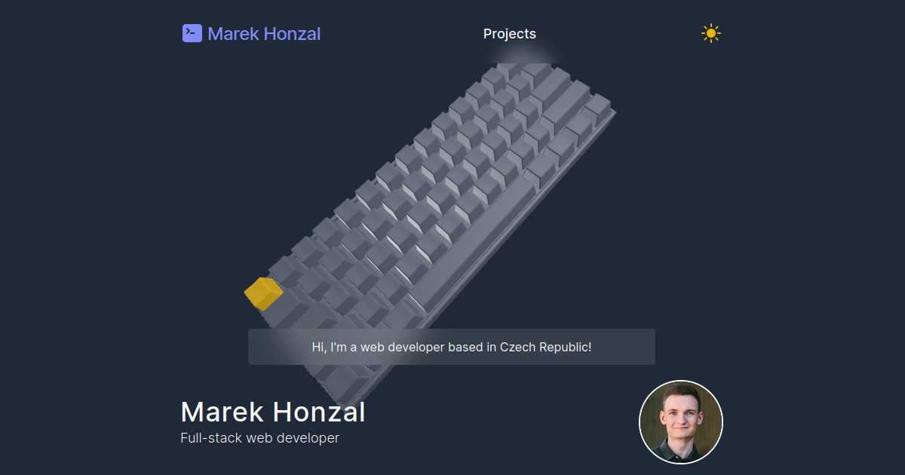

# My Portfolio - Marek Honzal

Portfolio website created with Next.js to showcase my projects I've been working on.

## Built With

- [Next.js](https://nextjs.org/)
- [React.js](https://reactjs.org/)
- [Tailwind CSS](https://tailwindcss.com/)
- [Three.js](https://threejs.org/)

### Prerequisites

- Node.js and npm/yarn/pnpm
- Clone this repository and `cd` into it

## Installation

When you have all prerequisites ready, you can install and start the application following these steps:

1. Install all dependencies - `npm install` or `yarn` or `pnpm install`
2. Run dev server - `yarn dev`

## Contributing

To start contributing to this project:

1. Clone the repository
2. Create a new branch - `git checkout -b feature/feature-name`
3. Commit your changes - `git commit -m 'feat: add my cool feature'`
4. Push to the branch - `git push origin feature/feature-name`
5. Open a Pull Request
